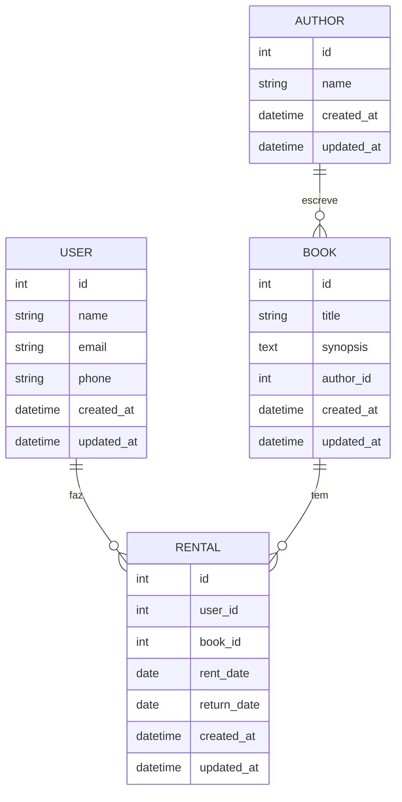

# LivrariaApp

## 📋 Descrição
Sistema de gerenciamento de biblioteca desenvolvido em Ruby on Rails, permitindo o controle de usuários, autores, livros e aluguéis.

## 🚀 Funcionalidades
- Cadastro e gerenciamento de usuários
- Cadastro e gerenciamento de autores
- Cadastro e gerenciamento de livros
- Sistema de aluguel de livros
- Interface em português
- Validações de dados
- Mensagens de feedback para o usuário

## 🛠️ Tecnologias Utilizadas
- Ruby on Rails 8.0
- Ruby 3.2.2
- SQLite3
- HTML/CSS
- Bootstrap (para estilização)

## 📦 Instalação

1. Clone o repositório:
```bash
git clone [URL_DO_REPOSITÓRIO]
```

2. Entre no diretório do projeto:
```bash
cd LivrariaApp
```

3. Instale as dependências:
```bash
bundle install
```

4. Configure o banco de dados:
```bash
rails db:create
rails db:migrate
```

5. Inicie o servidor:
```bash
rails server
```

## 📊 Diagrama do Projeto



## 📚 Aprendizados

### 1. Estrutura do Projeto Rails
- **Models**: Aprendemos a criar e relacionar modelos (User, Book, Author, Rental)
- **Controllers**: Implementação de CRUD completo para cada entidade
- **Views**: Criação de formulários e páginas de listagem
- **Migrations**: Criação e modificação de tabelas no banco de dados

### 2. Relacionamentos entre Modelos
- **has_many/belongs_to**: Implementação de relacionamentos 1:N
- **Validações**: Adição de regras de negócio nos modelos
- **Callbacks**: Uso de callbacks para manipulação de dados

### 3. Internacionalização (i18n)
- Configuração do Rails para suporte a múltiplos idiomas
- Criação de arquivos de tradução (pt-BR.yml)
- Implementação de traduções para:
  - Mensagens de erro
  - Labels de formulários
  - Mensagens de sucesso
  - Títulos de páginas

### 4. Validações e Mensagens de Erro
- Implementação de validações de presença
- Validações de formato (email)
- Validações personalizadas (disponibilidade de livros)
- Customização de mensagens de erro

### 5. Interface do Usuário
- Criação de formulários com form_with
- Implementação de selects com collection_select
- Estilização com CSS
- Feedback visual para o usuário

### 6. Boas Práticas
- Organização do código
- Nomenclatura de variáveis e métodos
- Comentários e documentação
- Tratamento de erros

### 7. Desafios Encontrados e Soluções
1. **Mensagens de Erro**
   - Problema: Mensagens em inglês e formato confuso
   - Solução: Implementação de traduções e formatação adequada

2. **Validações de Aluguel**
   - Problema: Permitir aluguel de livros já alugados
   - Solução: Implementação de validação personalizada

3. **Interface Responsiva**
   - Problema: Layout não adaptativo
   - Solução: Implementação de CSS responsivo

## 🔄 Fluxo de Desenvolvimento
1. Criação dos modelos e migrações
2. Implementação dos relacionamentos
3. Criação dos controllers e views
4. Adição de validações
5. Implementação de i18n
6. Estilização da interface
7. Testes e correções

## 📝 Próximos Passos
- Implementação de autenticação de usuários
- Adição de sistema de busca
- Implementação de relatórios
- Melhorias na interface do usuário
- Adição de testes automatizados

